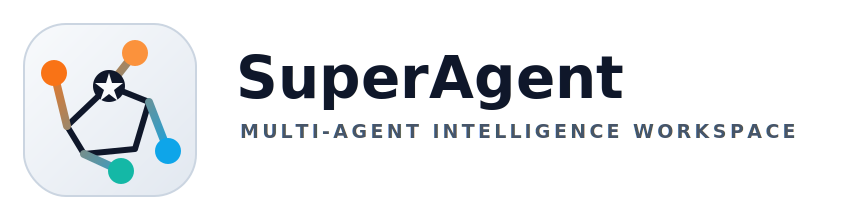

<p align="center">
  <picture>
    <source media="(prefers-color-scheme: dark)" srcset="docs/assets/superagent-logo-dark.svg">
    
  </picture>
</p>

# SuperAgent

> Multi-agent intelligence workspace for evidence-driven research, document ingestion, and persistent knowledge workflows.

SuperAgent is a setup-aware orchestration runtime that combines specialized agents, web and local evidence, durable memory, and structured run artifacts to produce research briefs, knowledge sessions, and report-ready analysis. The strongest product surface today is not "AI for everything"; it is intelligence work that needs traceability, synthesis, and reusable context.

[Docs](docs/index.md) · [Quickstart](docs/quickstart.md) · [Install](docs/install.md) · [Architecture](docs/architecture.md) · [Agents](docs/agents.md) · [Integrations](docs/integrations.md) · [Security](docs/security.md) · [Examples](docs/examples.md)

## Quickstart

1. Install the repo locally.

```bash
./scripts/install.sh
```

2. Configure environment and choose a working directory.

```bash
cp .env.example .env
superagent workdir here
superagent setup status
```

3. Run your first intelligence brief.

```bash
superagent run --current-folder \
  "Create an intelligence brief on Stripe: business model, products, competitors, recent strategy moves, and top risks."
```

The runtime may stop first on an approval-ready plan before executing the workflow. See [Quickstart](docs/quickstart.md) for the full walkthrough.

## Primary Workflows

- research briefs on people, companies, organizations, and document sets
- local-drive intelligence across mixed file types with OCR and per-document summaries
- persistent `superRAG` sessions over files, URLs, databases, and OneDrive
- report-ready synthesis with citations, logs, memory, and per-run artifacts

## Feature Status Matrix

| Status | Areas | What It Means Today |
| --- | --- | --- |
| Stable | core CLI and runtime, setup-aware discovery and routing, local-drive intelligence, report synthesis, `superRAG` knowledge sessions | strongest current product path and best place for new users to start |
| Beta | OpenAI deep research, long-document workflow, gateway HTTP surface, communication, monitoring, AWS, travel, authorized defensive security workflows, research proposal and patent workflows, deal-advisory workflows | implemented and usable, but more dependent on setup, tooling, or operational validation |
| Experimental | dynamic agent factory flow, generated agents, voice/audio workflows, future social ecosystem analysis | present or scaffolded, but not part of the primary product promise |

## Docs Map

- [Docs Index](docs/index.md)
  Main navigation page for the documentation set.
- [Product Overview](docs/product_overview.md)
  Current product thesis, scope boundaries, and workflow priorities.
- [Quickstart](docs/quickstart.md)
  First install, setup, and first run.
- [Install](docs/install.md)
  Local installation, environment configuration, Docker, and verification.
- [Architecture](docs/architecture.md)
  Runtime flow, discovery, setup-aware routing, persistence, and services.
- [Agents](docs/agents.md)
  Workflow families, status labels, and the full built-in inventory.
- [Integrations](docs/integrations.md)
  Providers, channels, OAuth-backed setup, plugin discovery, and MCP services.
- [Security](docs/security.md)
  Safety boundaries, authorized security workflow, and privileged controls.
- [Troubleshooting](docs/troubleshooting.md)
  First-run issues, setup gating, optional tools, and verification caveats.
- [Examples](docs/examples.md)
  Stable, beta, and experimental CLI examples.

## Supporting References

- [Core Intelligence Stack](docs/super_agent_stack.md)
- [superRAG](docs/superrag_feature.md)
- [Local Drive Case Study](docs/local_drive_case_study.md)
- [Extended CLI Examples](SampleTasks.md)

## What Exists Today Under The Hood

The current codebase already includes:

- dynamic registry and discovery in [`superagent/discovery.py`](superagent/discovery.py)
- orchestration runtime in [`superagent/runtime.py`](superagent/runtime.py)
- CLI entrypoint in [`superagent/cli.py`](superagent/cli.py)
- optional HTTP gateway and dashboard in [`superagent/gateway_server.py`](superagent/gateway_server.py)
- internal A2A-inspired task and artifact protocol in [`tasks/a2a_protocol.py`](tasks/a2a_protocol.py)
- durable SQLite persistence in [`tasks/sqlite_store.py`](tasks/sqlite_store.py)
- shared research infrastructure in [`tasks/research_infra.py`](tasks/research_infra.py)
- Docker and MCP deployment assets in [`docker-compose.yml`](docker-compose.yml) and [`mcp_servers/`](mcp_servers)

## Known Gaps

What exists now is a strong base, not a finished intelligence platform.

Current gaps documented in the repo:

- no dedicated social connector agents yet
- no external graph database yet
- no sanctions or corporate registry APIs yet
- no end-to-end Docker Compose validation has been performed in this repo

## Verification Status

The repo documents these as verified today:

- Python import safety
- compileability
- orchestrator registration
- agent module structure
- Docker asset presence

Not fully verified:

- live end-to-end external API workflows
- Docker runtime execution
- MCP client interoperability
- heavy-load vector indexing behavior

## Engineering Playbooks

These docs define how the project should be improved and how future LLM-driven features must be added.

- [Project Upgrade Plan](docs/project_upgrade_plan.md)
- [LLM Feature Delivery Guide](docs/llm_feature_delivery_guide.md)
