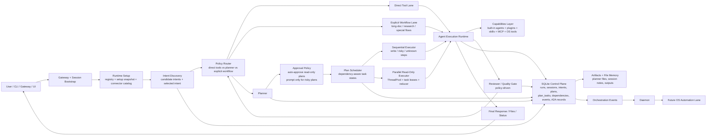

# Current Orchestration Runtime

This is the current high-level architecture of the application after the orchestration control-plane work completed so far.

It reflects the system as it works now, not the long-term target architecture.

## Runtime Diagram

## What This Solves

- Reduces routing randomness by adding intent discovery before execution.
- Stops plans from living only in memory by persisting plans, tasks, dependencies, and events in SQLite.
- Prevents duplicate planned-step execution with task leases.
- Improves speed by allowing safe planned `read_only` steps to run in parallel.
- Improves reliability by keeping risky, write, and unknown work serialized.
- Reduces user friction by auto-approving conservative read-only plans.
- Reduces infinite-loop risk with a no-progress watchdog that can stop or replan stalled runs.
- Creates an event trail that the daemon can observe for future OS-level automation.

## Current Boundaries

- True parallelism exists only for planned `read_only` batches.
- Write steps, external actions, and unknown capabilities still run in the sequential lane.
- The daemon can observe orchestration events, but full event-driven OS automation is still a next phase.
- This is a stronger orchestration kernel than before, but it is not yet full conflict-aware parallel execution for all task types.

## Key Modules

- [`kendr/runtime.py`](../kendr/runtime.py): main orchestration runtime, scheduler state, watchdog, and parallel batch executor.
- [`kendr/workflow_execution_policies.py`](../kendr/workflow_execution_policies.py): policy routing and planned-batch dispatch rules.
- [`tasks/planning_tasks.py`](../tasks/planning_tasks.py): plan generation, read-only auto-approval, and plan persistence.
- [`kendr/persistence/orchestration_store.py`](../kendr/persistence/orchestration_store.py): intents, plans, plan tasks, dependencies, events, and task leases.
- [`kendr/orchestration/plan_safety.py`](../kendr/orchestration/plan_safety.py): conservative step safety classification and parallel-read eligibility.
- [`kendr/daemon.py`](../kendr/daemon.py): daemon-side event observation for future automation hooks.
